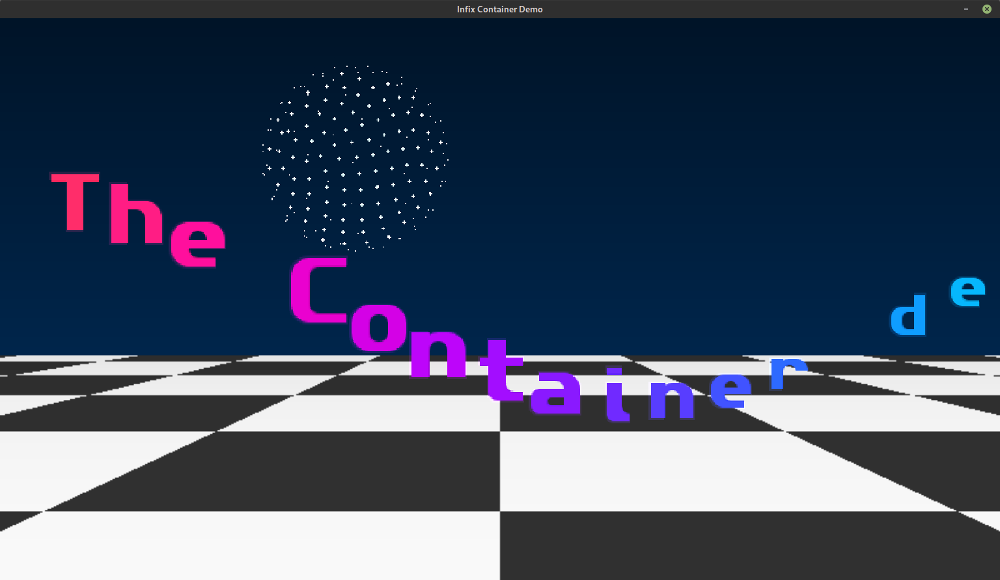

# Oldschool Demo for Shows etc.

[](https://opensource.org/licenses/MIT)
[](https://github.com/kernelkit/demo/actions)
[](https://ghcr.io/kernelkit/demo)
[](https://github.com/kernelkit/demo/releases/latest)

A classic demoscene-style demo featuring multiple visual effects with
oldschool aesthetics. Built with SDL2 and inspired by 1990s Amiga/PC
demos.



## Features

### Visual Effects

The demo includes 9 different scenes that cycle automatically:

- **Starfield** — 3D star field with rotating textured Jack sphere, periodic particle bursts, and burning logo effects
- **Plasma** — Colorful plasma effect with animated gradients
- **Rotating Cube** — Texture-mapped 3D cube with copper bars background
- **Tunnel** — Psychedelic texture-mapped tunnel effect
- **Bouncing Logo** — Physics-based bouncing and rotating logo
- **Raining Logo** — Multiple logos falling with physics
- **3D Star Ball** — Fibonacci sphere with rotating dots
- **Checkered Floor** — Classic perspective floor with bouncing starball
- **Rotozoomer** — Rotating and zooming texture effect

### Text Scrollers

Multiple scroller styles with smooth effects:

- **Classic** — Traditional bottom scroller
- **Sine Wave** — Undulating wave motion
- **3D Roller** — Perspective roller with configurable outline/glow effects
- **Bounce** — Bouncing text with squash/stretch

### Interactive Features

- Dynamic scroll text with control codes for speed, color, style changes, and pauses
- Command-line options for fullscreen, window size, scene selection, and duration
- Custom scroll text loading from files
- Embedded MOD tracker music playback
- Configurable roller text effects (4 visual modes)

## Quick Start

### Download and Run (Easiest)

Download the latest AppImage for your architecture:

**x86_64 (Intel/AMD):**

```bash
wget https://github.com/kernelkit/demo/releases/latest/download/InfixDemo-x86_64.AppImage
chmod +x InfixDemo-x86_64.AppImage
./InfixDemo-x86_64.AppImage
```

**aarch64 (ARM64):**

```bash
wget https://github.com/kernelkit/demo/releases/latest/download/InfixDemo-aarch64.AppImage
chmod +x InfixDemo-aarch64.AppImage
./InfixDemo-aarch64.AppImage
```

No installation required! The AppImage bundles all dependencies.

### Run with Docker

**Pull and run the latest image:**

```bash
# Allow X11 connections (run once per session)
xhost +local:docker

# Run the demo (video only)
docker run --rm -it \
  -e DISPLAY=$DISPLAY \
  -v /tmp/.X11-unix:/tmp/.X11-unix \
  ghcr.io/kernelkit/demo:latest
```

**With audio support (PulseAudio/PipeWire):**

```bash
xhost +local:docker
docker run --rm -it \
  -e DISPLAY=$DISPLAY \
  -v /tmp/.X11-unix:/tmp/.X11-unix \
  -e SDL_AUDIODRIVER=pulseaudio \
  -e PULSE_SERVER=unix:${XDG_RUNTIME_DIR}/pulse/native \
  -v ${XDG_RUNTIME_DIR}/pulse/native:${XDG_RUNTIME_DIR}/pulse/native \
  ghcr.io/kernelkit/demo:latest
```

**With specific window size:**

```bash
# Useful if container detects wrong screen dimensions
docker run --rm -it \
  -e DISPLAY=$DISPLAY \
  -v /tmp/.X11-unix:/tmp/.X11-unix \
  -e SDL_AUDIODRIVER=pulseaudio \
  -e PULSE_SERVER=unix:${XDG_RUNTIME_DIR}/pulse/native \
  -v ${XDG_RUNTIME_DIR}/pulse/native:${XDG_RUNTIME_DIR}/pulse/native \
  ghcr.io/kernelkit/demo:latest \
  ./demo -w 1920x1080
```

**Or use docker-compose:**

```bash
docker compose up
```

## Building from Source

### Dependencies

On Debian/Ubuntu/Mint:
```bash
sudo apt install libsdl2-dev libsdl2-ttf-dev libsdl2-image-dev libsdl2-mixer-dev
```

On Fedora/RHEL:
```bash
sudo dnf install SDL2-devel SDL2_ttf-devel SDL2_image-devel SDL2_mixer-devel
```

On Arch:
```bash
sudo pacman -S sdl2 sdl2_ttf sdl2_image sdl2_mixer
```

### Build and Run

```bash
make
./demo
```

### Build AppImage

```bash
make appimage
```

Creates a portable `InfixDemo-<arch>.AppImage` file.

### Build Docker Image

```bash
docker build -t demo .
```

## Command-Line Options

```
Usage: demo [OPTIONS] [SCENE...]

Display Options:
  -f, --fullscreen   Run in fullscreen mode (scales to display)
  -w, --window WxH   Set window size (e.g., 1920x1080)
  -s, --scale N      Integer scaling (e.g., 2 = 1600x1200)

Playback Options:
  -d, --duration SEC Scene duration in seconds (default: 15)
  -t, --text FILE    Load scroll text from file
  -r, --roller N     Roller effect: 0=all, 1=no outline, 2=clean, 3=color (default: 1)
  -h, --help         Show this help message

Scenes:
  0 - Starfield      3 - Tunnel           6 - 3D Star Ball
  1 - Plasma         4 - Bouncing Logo    7 - Rotozoomer
  2 - Cube           5 - Raining Logo     8 - Checkered Floor

Examples:
  demo -f                    # Fullscreen, auto-cycle scenes
  demo -s 2                  # 2x window size (1600x1200)
  demo -w 1920x1080          # Custom window size
  demo -d 30 2 6             # Show cube & star ball, 30s each
  demo -t /mnt/scroll.txt    # Custom scroll text
  demo -r 2 0                # Clean roller effect, starfield only
```

## Customizing Scroll Text

### Using Custom Text File

Create a text file with your scroll message:
```bash
echo "Hello demoscene!    This is my custom scroller..." > myscroll.txt
./demo -t myscroll.txt
```

### Control Codes

The scroll text supports embedded control codes for dynamic effects:

| Code | Description | Example |
|------|-------------|---------|
| `{PAUSE:seconds}` | Pause scrolling for N seconds | `{PAUSE:3}` |
| `{SPEED:pixels}` | Change scroll speed (pixels/sec) | `{SPEED:100}` |
| `{STYLE:name}` | Switch scroll effect style | `{STYLE:roller}` |
| `{COLOR:r,g,b}` | Set text color (RGB 0-255) | `{COLOR:255,0,0}` |

**Available Styles:**
- `wave` - Sine wave scroller
- `roller` - 3D roller scroller with outline and glow
- `classic` - Traditional bottom scroller
- `bounce` - Bouncing text with squash/stretch

**Example scroll.txt:**
```
{SPEED:400}{STYLE:bounce}

Welcome to...   the Demo!{PAUSE:2}
{SPEED:400}

Now scrolling... FAST!{SPEED:800}

{SPEED:400}
{STYLE:roller}Now with 3D roller!      {PAUSE:1.5}

{COLOR:255,0,0}
RED

{COLOR:0,255,0}
GREEN

{COLOR:0,0,255}
BLUE

{COLOR:0,0,0}{STYLE:wave}Back to waves...    Greetings to the demoscene! <3
```

**Note:** Use `{COLOR:0,0,0}` to return to the default rainbow gradient effect.

## Adding Custom Music

The demo supports MOD/XM/IT tracker music files:

1. Download a MOD file from [The Mod Archive](https://modarchive.org/)
2. Rename it to `music.mod`
3. Place it in the project directory
4. Rebuild: `make clean && make`

The music will be embedded in the binary.

## Development

### Project Structure

```
.
├── demo.c              # Main source code
├── Makefile           # Build system
├── Dockerfile         # Container build
├── utils/
│   └── build-appimage.sh  # AppImage build script
├── .github/
│   └── workflows/
│       └── build.yml  # CI/CD pipeline
├── topaz-8.otf        # Embedded font
├── jack.png           # Texture asset
├── logo.png           # Logo asset
├── infix.png          # Infix logo for fire effect
├── wires.png          # Wires logo for fire effect
├── scroll.txt         # Default scroll text
└── music.mod          # Optional MOD music file
```

### Architecture Support

- **x86_64** (Intel/AMD 64-bit)
- **aarch64** (ARM 64-bit)

Both architectures are built automatically via GitHub Actions and released as AppImages and Docker images.

## Assets & Licenses

### Code

MIT License - See LICENSE file for details.

### Font

The FontStruction [Amiga Topaz 8](https://fontstruct.com/fontstructions/show/889446) by [nonarkitten](https://fontstruct.com/fontstructors/828567/nonarkiteen) is licensed under a Creative Commons Attribution [Share Alike license](http://creativecommons.org/licenses/by-sa/3.0/).

### Music

The demo includes **"Enigma"** by [Phenomena](https://modarchive.org/index.php?request=view_artist_modules&query=72943), licensed under the [Mod Archive Distribution license](https://modarchive.org/index.php?request=view_by_license&query=publicdomain).

## Contributing

Contributions are welcome! Feel free to:
- Report bugs or request features via [GitHub Issues](https://github.com/kernelkit/demo/issues)
- Submit pull requests with improvements
- Share your custom scroll texts and music combinations

## Acknowledgments

Inspired by classic Amiga and PC demos from the 1990s demoscene. Special thanks to:
- The demoscene community for decades of creative inspiration
- SDL2 developers for the excellent multimedia library
- Mod Archive for preserving tracker music history
- Classic demoscene resources at [lodev.org](https://lodev.org/cgtutor/)

---

**Made with ❤️ for the demoscene**
