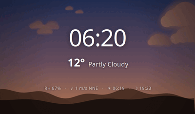
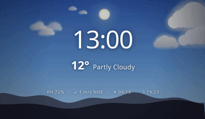
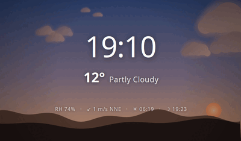
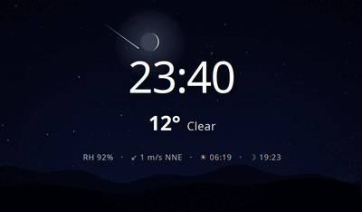
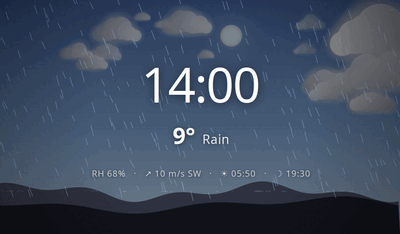
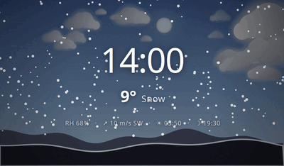
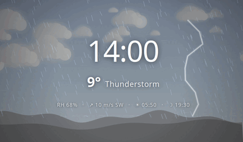
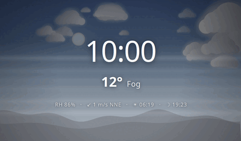

# Breeze -- Weather & Time Display

A GTK-based weather and time display with animated Cairo backgrounds.
Touch anywhere to show a configurable web page (e.g., a dashboard), then
return to the weather view.  Given a carousel interval, breeze cycles
between the two on its own.

## Screenshots

Click any image for the full-size version.  The bottom four were coaxed
out of a fair-weather forecast with `--weather`.

|   |   |
|---|---|
| [](screenshots/dawn.png)<br>**Dawn** -- the sky is keyed on the sun's altitude, so the light moves all day | [](screenshots/midday.png)<br>**Midday** -- the sun rides the arc between sunrise and sunset |
| [](screenshots/sunset.png)<br>**Sunset** -- a low sun lights the clouds from the side and warms their undersides | [](screenshots/night.png)<br>**Clear night** -- the moon at its real phase with earthshine, stars, and a shooting star |
| [](screenshots/rain.png)<br>**Rain** -- drops slant with the wind and splash where they land | [](screenshots/snow.png)<br>**Snow** -- settling along the ridge |
| [](screenshots/thunder.png)<br>**Thunderstorm** -- a bolt and a flash every few seconds | [](screenshots/fog.png)<br>**Fog** -- a veil thickening towards the ground |

## Features

- Live weather from [Open-Meteo](https://open-meteo.com/) (no API key needed)
- A sky that follows the sun: night, blue hour, dawn, golden hour, midday
- Sun and moon ride the arc between sunrise and sunset, the moon drawn at
  its real phase, over stars and the occasional shooting star
- Clouds lit from the sun's side, drifting in three layers over a horizon
- Weather you can see: rain and snow slanting with the wind, splashes,
  snow settling on the ridge, fog banks, lightning
- Location lookup by city name (geocoding via Open-Meteo)
- Touch/click to show a web page (WebKitGTK), auto-returns after 30s
- Carousel mode: cycle between the weather view and one or more URLs
- Fullscreen kiosk mode, display rotation, and burn-in protection

## Quick Start

### Build and Run

```bash
sudo apt install libgtk-3-dev libwebkit2gtk-4.1-dev libsoup-3.0-dev libcjson-dev
make
./breeze -l Stockholm -f
```

Two URLs, each shown for 30 seconds with a minute of weather in between:

```bash
./breeze -l Surahammar -f \
    --url https://app.formula1dashboard.com/ \
    --url https://www.yr.no/en/forecast/hourly-table/2-2670613/Sweden/V%C3%A4stmanland%20County/Surahammar%20Municipality/Surahammar \
    --carousel-weather 60 --carousel-url 30
```

### Run with Docker

```bash
docker compose up breeze
```

Or standalone:

```bash
docker run --rm -it \
  --privileged \
  -v /dev/fb0:/dev/fb0 \
  -v /dev/tty1:/dev/tty1 \
  -v /dev/input:/dev/input \
  -v /run/udev:/run/udev:ro \
  -v /etc/localtime:/etc/localtime:ro \
  -e LOCATION=Stockholm \
  -e WEB_URL=https://example.com \
  -e DISPLAY_ROTATE=right \
  ghcr.io/kernelkit/breeze:latest
```

## Command-Line Options

```
Usage: breeze [OPTIONS]

Options:
  -f, --fullscreen              Run in fullscreen mode
  -l, --location LOCATION       City or Country,City (e.g., "Stockholm"
                                or "Sweden,Stockholm"), geocoded via Open-Meteo
      --lat LATITUDE            Latitude for weather (default: 59.3293)
      --lon LONGITUDE           Longitude for weather (default: 18.0686)
      --url URL                 Web page URL (repeatable for carousel)
      --carousel-weather SECS   Weather display time in carousel mode (default: 60)
      --carousel-url SECS       URL display time in carousel mode (default: 30)
      --weather TYPE            Force a condition, for demos: clear, partly,
                                overcast, fog, drizzle, rain, snow, showers,
                                thunder
  -h, --help                    Show this help message
```

`--weather` paints a condition over whatever the forecast says, which is
how to show a thunderstorm on a stand in fair weather:

```bash
./breeze -l Stockholm -f --weather thunder
```

Setting either carousel option enables automatic cycling between the
weather view and the URLs.  Without them, touch/click toggles between
the views manually, stepping through the URLs round-robin.

Press Escape to exit.

## Environment Variables

Every option has an environment variable counterpart, used when the
option is not given on the command line.  This is how the container is
configured.

| Variable           | Option               | Description                                   |
|--------------------|----------------------|-----------------------------------------------|
| `FULLSCREEN`       | `-f`                 | Fullscreen mode: `1`, `true`, `yes`, or `on`  |
| `LOCATION`         | `-l`                 | City or Country,City, geocoded via Open-Meteo |
| `LATITUDE`         | `--lat`              | Latitude, when `LOCATION` is not used         |
| `LONGITUDE`        | `--lon`              | Longitude, when `LOCATION` is not used        |
| `WEB_URL`          | `--url`              | Comma-separated list of URLs                  |
| `CAROUSEL_WEATHER` | `--carousel-weather` | Seconds to show the weather view              |
| `CAROUSEL_URL`     | `--carousel-url`     | Seconds to show each URL                      |
| `WEATHER`          | `--weather`          | Force a condition, for demos                  |

Two more are read by `start.sh` and the C library rather than by breeze
itself:

| Variable         | Description                                                |
|------------------|------------------------------------------------------------|
| `DISPLAY_ROTATE` | `normal`, `left`, `right`, or `inverted`                   |
| `TZ`             | Timezone, e.g. `Europe/Stockholm`                          |

### Timezone

A container has no timezone of its own, it runs in UTC, which puts the
clock and the sunrise/sunset times an hour or two off in Sweden.  Either
bind mount the host's zone file, the way `docker-compose.yml` does:

```bash
-v /etc/localtime:/etc/localtime:ro
```

or name the zone, which is what to do where there is no host zone file
to mount:

```bash
-e TZ=Europe/Stockholm
```

### Display Rotation

`DISPLAY_ROTATE` turns the screen a quarter, half, or three quarters of
a turn, and takes the touchscreen with it -- the two are separate in X,
so rotating the display alone leaves taps landing in the wrong place.
The official Raspberry Pi touch display, mounted portrait, wants `left`
or `right` depending on which way up.

Rotation is applied whether breeze starts its own X server or attaches
to one that is already running.

## Display Load

The scene is drawn with Cairo through the X server, so most of the cost
lands in Xorg rather than in breeze.  The layers that change slowly --
the sky, the hills, the vignette, and each cloud -- are painted into
surfaces and blitted, and repainted only when the light has moved on.
Measured at 1024x600 under Xvfb, as a percentage of one core:

| Condition | breeze | X server |
|-----------|--------|----------|
| Clear     | 1.1    | 8.1      |
| Overcast  | 1.1    | 10.0     |
| Snow      | 4.7    | 9.8      |

The animation stops entirely while the web view is up.

## Dependencies

| Library        | Package (Debian/Ubuntu)    | Purpose              |
|----------------|----------------------------|----------------------|
| GTK 3          | `libgtk-3-dev`             | GUI framework        |
| WebKitGTK 4.1  | `libwebkit2gtk-4.1-dev`    | Embedded web view    |
| libsoup 3.0    | `libsoup-3.0-dev`          | HTTP client          |
| cJSON          | `libcjson-dev`             | JSON parsing         |

## Vendored Code

The following files are vendored (copied into this repository) to avoid
external build-time dependencies on libraries not commonly packaged:

| Files                    | Origin                                                                 | License      |
|--------------------------|------------------------------------------------------------------------|--------------|
| `sunriset.c`, `sunriset.h` | [troglobit/sun](https://github.com/troglobit/sun) by Paul Schlyter | Public domain |

Originally written as DAYLEN.C (1989) by Paul Schlyter, modified to
SUNRISET.C (1992), split into header by Joachim Nilsson (2017).
Released to the public domain by Paul Schlyter, December 1992.

## License

MIT License -- See [../LICENSE](../LICENSE) for details.
